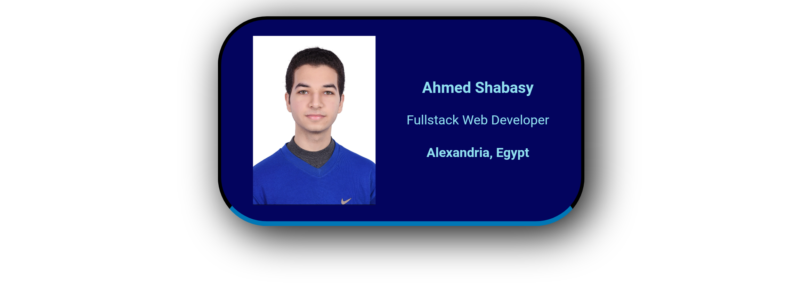

# Digital Business Card

A static website developed with Scrimba using HTML & CSS for my own digital business card.

## Description

This website is a part of solo projects that was made during Scrimba's <a href="https://scrimba.com/learn-html-and-css-c0p/" target="_blank">HTML & CSS course</a>. It uses key CSS features and concepts, such as shadows, flexbox, borders, border radius, paddings, and fonts.

## Technologies Used
* HTML5
* CSS3

## Key Learning Outcomes

- Used flexbox to build one-dimensional layout.
- Set the font to a specific font family (sans-serif).
- Centered the content using margins.
- Centered the flex content using text-align and justify-content properties.
- Gave the elements wonderful shapes using borders paddings, and shadows.

## Live Demo
Check out the live demo <a href="https://shabasy-business-card.netlify.app/" target="_blank">here</a>.

## Contributing

Suggestions and feedback are welcome! feel free to:
* Suggest new features.
* Share best practices.

## Conclusion

I'm eager to apply these skills in real-world project. I will continue doing projects with this wonderful <a href="https://scrimba.com/learn-html-and-css-c0p/" target="_blank">course</a> from <a href="https://scrimba.com/" target="_blank">Scrimba</a>.
